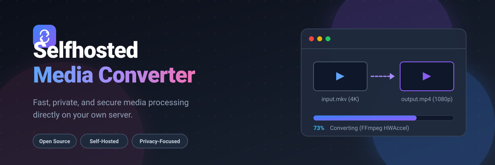
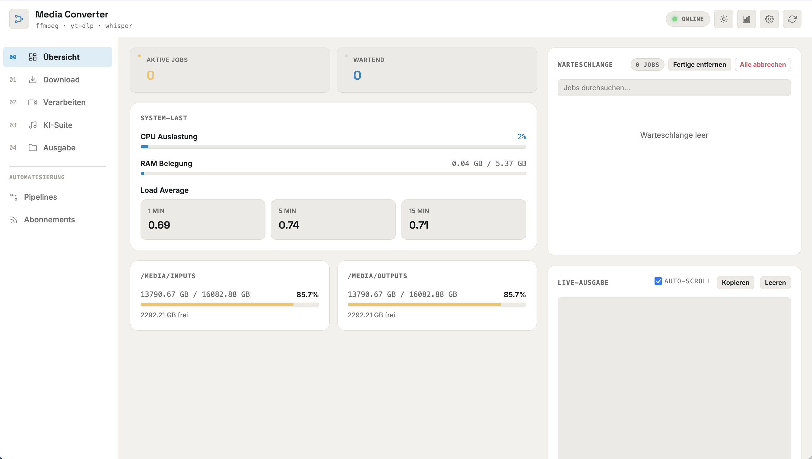
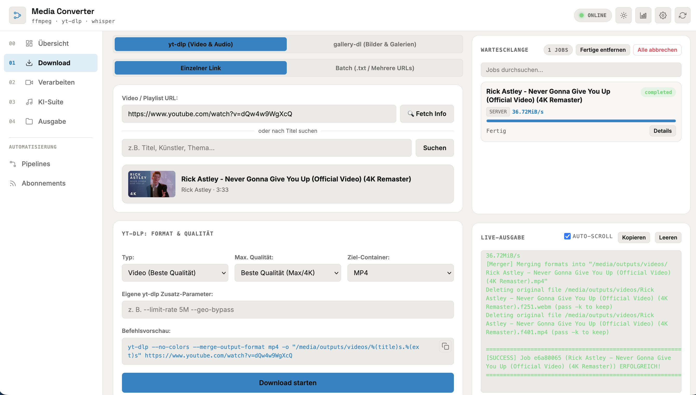
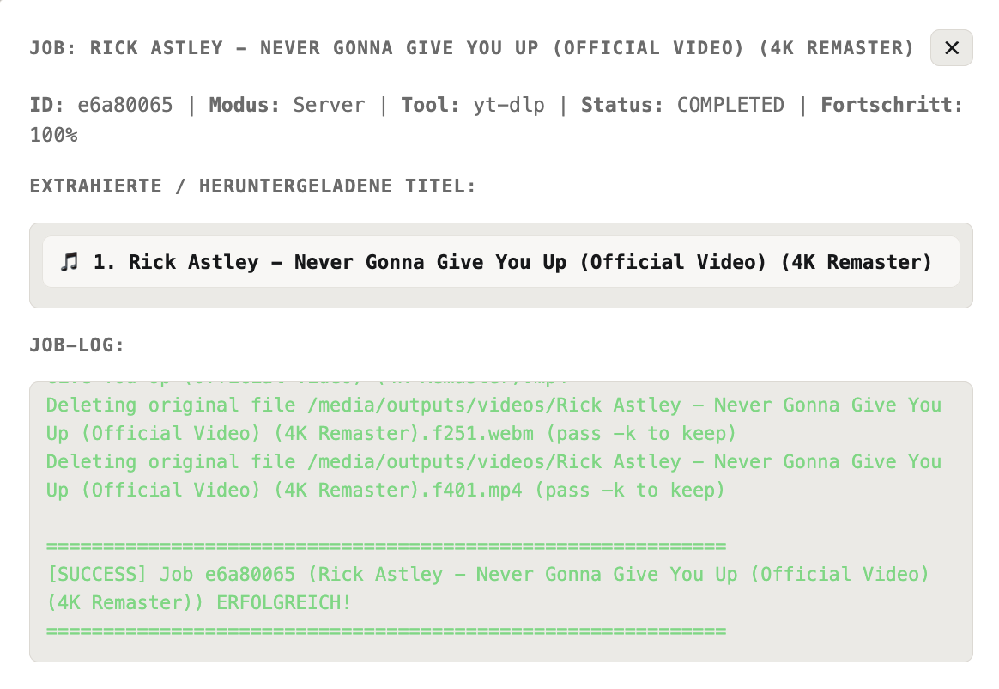
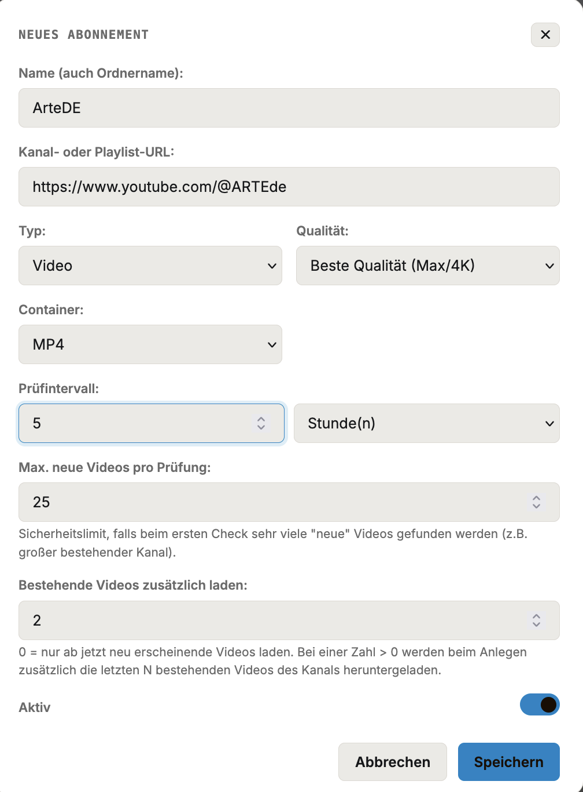
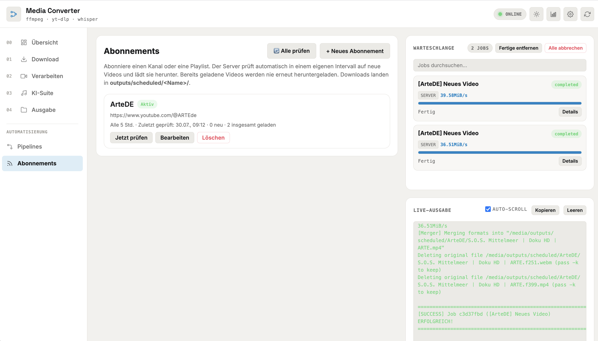
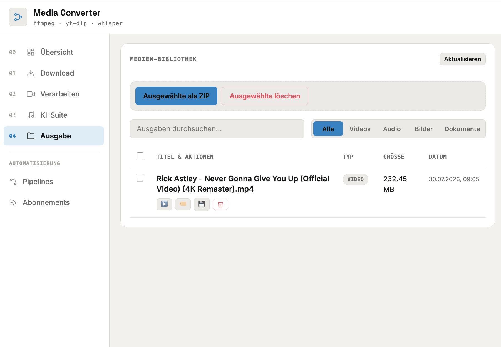

# Media Converter

Disclaimer: Vibe-coding project. The web UI is currently German-only — an English version is planned.

<p align="center">
  
</p>

<p align="center">
  Self-hosted media processing platform for downloading, converting, transcribing and managing audio, video and image files.
</p>

<p align="center">
  
  
  
  
  
  
</p>

---

## Screenshots

<p align="center">
  
</p>

<br>

<p align="center">
  
</p>

<br>

<p align="center">
  
</p>

<br>

<p align="center">
  
</p>

<br>

<p align="center">
  
</p>

<br>

<p align="center">
  
</p>

---

## Overview

Media Converter is a self-hosted media toolkit for downloading, converting, transcribing and processing multimedia files.

The application combines **yt-dlp**, **gallery-dl**, **FFmpeg** and **OpenAI Whisper** with a modern web interface, background job processing, live logs and system monitoring.

Designed to run locally or on a private server using Docker.

---

## Features

### Media Download

- Download videos, audio and playlists using **yt-dlp**
- Download image galleries using **gallery-dl**
- Support for multiple media sources, including cookie-based authentication
- Background processing queue with per-domain and global concurrency limits
- Job history tracking
- Bulk ZIP downloads

### Video Conversion

- Convert videos between:
  - MP4
  - MKV
  - WEBM
  - GIF

- Encoding support:
  - H.264
  - H.265
  - AV1

Additional processing:

- Thumbnail extraction
- Frame extraction
- Audio/video muxing
- Playback speed adjustment

### Audio Processing

- Extract audio tracks from videos
- Convert audio formats:
  - MP3
  - M4A
  - WAV
  - FLAC

### AI Transcription

Powered by **OpenAI Whisper**.

Supported models:

- tiny
- base
- small
- medium
- large-v3

Generated outputs:

- Subtitle files (`.srt`)
- Text transcripts (`.txt`)

### Image Processing

Convert images between:

- JPG
- PNG
- WEBP

### Automation & Notifications

- Reusable processing pipelines
- Subscriptions for automatically fetching new content from a source
- Optional push notifications via Pushover
- Optional automatic cleanup of old files

---

## Quick Start

### Requirements

Before installing, make sure the following are available:

- Docker
- Docker Compose

### Installation

Clone the repository:

```bash
git clone https://github.com/Frxhb/selfhosted-media-converter.git

cd selfhosted-media-converter
```

### Configuration

Create an environment file (even an empty one works, since every setting has a sane default):

```bash
touch .env
```

Then edit `docker-compose.yml` according to your environment — most commonly:

- exposed port
- mounted directories
- timezone (`TZ`)
- container name

Optional settings can be placed in `.env` and are picked up automatically. The most relevant ones:

| Variable | Default | Description |
|----------|---------|-------------|
| `MAX_CONCURRENT_JOBS` | `2` | Maximum number of jobs processed in parallel |
| `MAX_CONCURRENT_PER_DOMAIN` | `2` | Maximum parallel downloads per source domain |
| `MAX_CONCURRENT_WHISPER_JOBS` | `1` | Maximum parallel transcription jobs |
| `FFMPEG_THREADS` | `Auto` | Threads FFmpeg is allowed to use |
| `DEFAULT_PRIORITY` | `below_normal` | Default OS process priority for jobs |
| `MIN_FREE_DISK_GB` | `2.0` | Minimum free disk space before new jobs are accepted |
| `AUTO_DELETE_ORIGINALS` | `false` | Delete source files after successful processing |
| `AUTO_CLEANUP_DAYS` | `0` | Auto-delete outputs older than N days (`0` disables it) |
| `LOG_LEVEL` | `INFO` | Application log level |
| `PUSHOVER_ENABLED` | `false` | Enable Pushover push notifications |

Most of these can also be changed later from the web UI's settings page.

Default directory structure (created automatically on first start):

```text
media/
├── inputs/
└── outputs/

config/
```

### Start Application

Build and start the container:

```bash
docker compose up --build -d
```

The web interface will be available at:

```text
http://<server-ip>:8080
```

---

## Updating

Pull the latest changes:

```bash
git pull
```

Rebuild the application:

```bash
docker compose up --build -d
```

To completely recreate the environment:

```bash
docker compose down

docker compose up --build -d
```

---

## Directory Structure

| Directory | Description |
|-----------|-------------|
| `media/inputs` | Source files available for processing |
| `media/outputs` | Generated output files |
| `config` | Application configuration and SQLite database |
| `config/logs` | Application logs (rotated automatically) |

---

## Architecture

```text
                     Browser
                        |
                        v
                 FastAPI Web UI
                        |
        +---------------+---------------+---------------+
        |               |               |               |
        v               v               v               v
   Job Queue        FFmpeg          yt-dlp          gallery-dl
        |
        v
 Whisper Transcription
```

---

## Tech Stack

| Component | Technology |
|-----------|------------|
| Backend | FastAPI |
| Media Processing | FFmpeg |
| Video/Playlist Downloads | yt-dlp |
| Gallery/Image Downloads | gallery-dl |
| AI Transcription | OpenAI Whisper |
| Database | SQLite |
| Containerisation | Docker |
| Communication | WebSockets |

---

## Roadmap

Planned improvements:

- English UI translation
- User authentication
- GPU acceleration for Whisper
- Hardware accelerated encoding
- Additional media providers
- Workflow automation
- Cloud storage integrations
- Extended monitoring features

---

## Contributing

Contributions, bug reports and feature requests are welcome.

Please open an issue or submit a pull request.

---

## License

This project is licensed under the MIT License.
